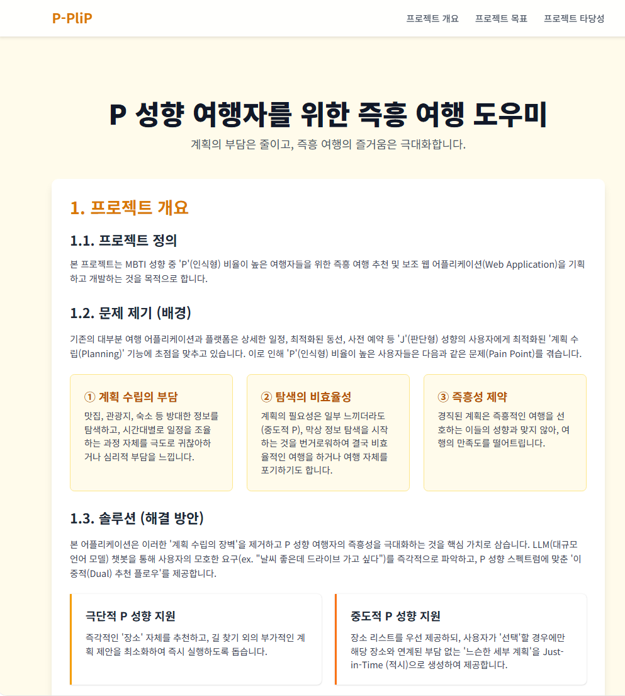
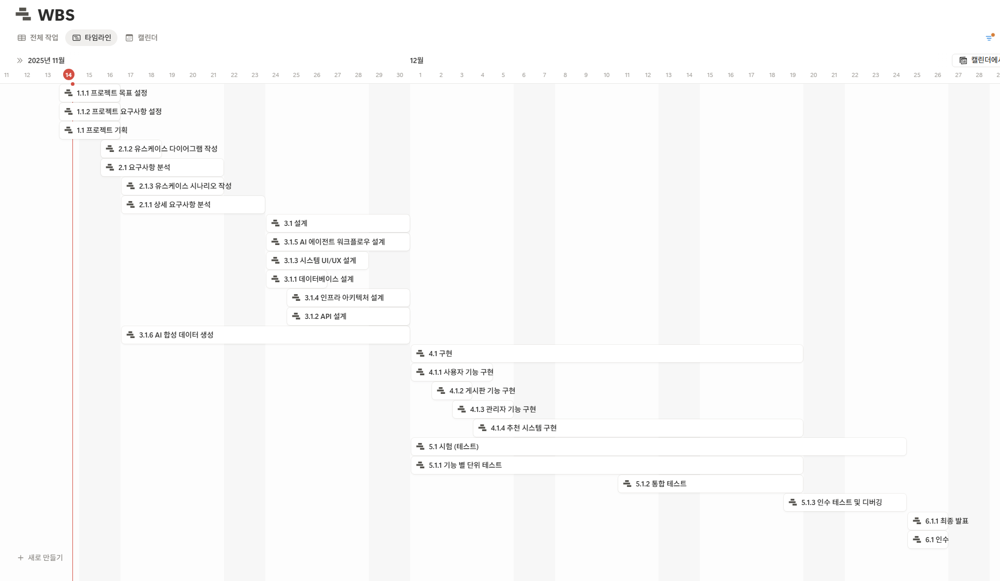
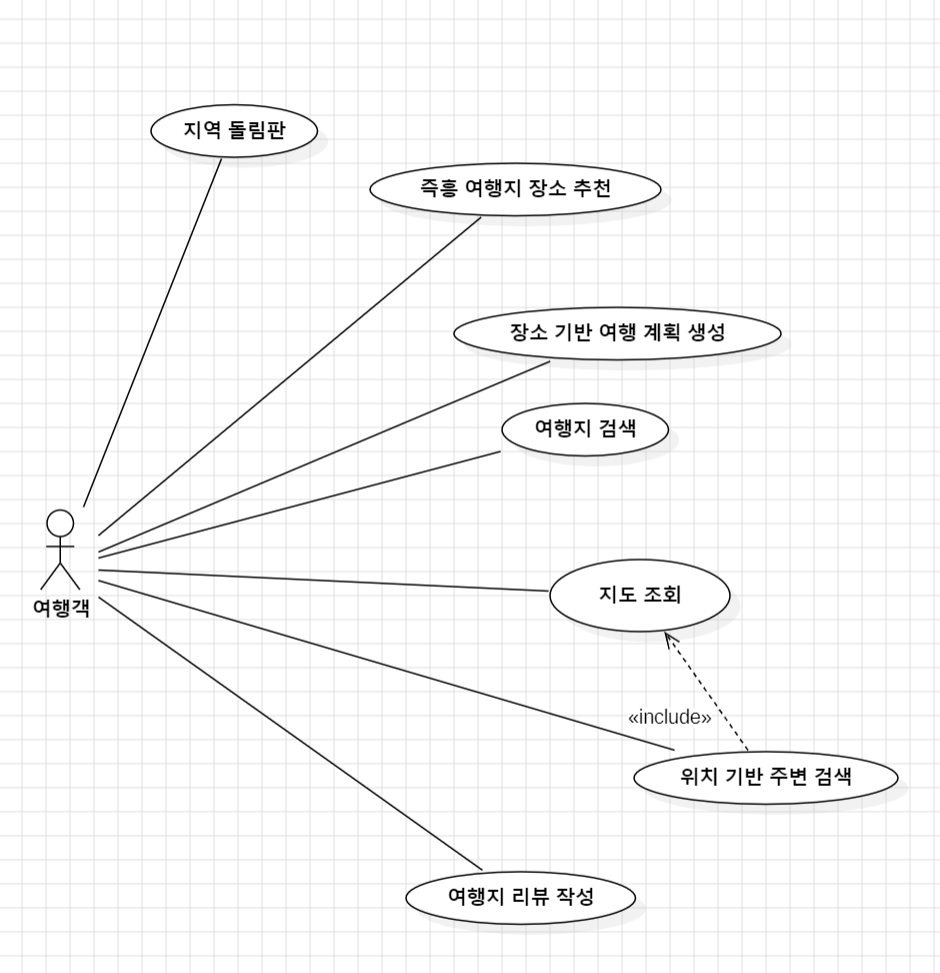
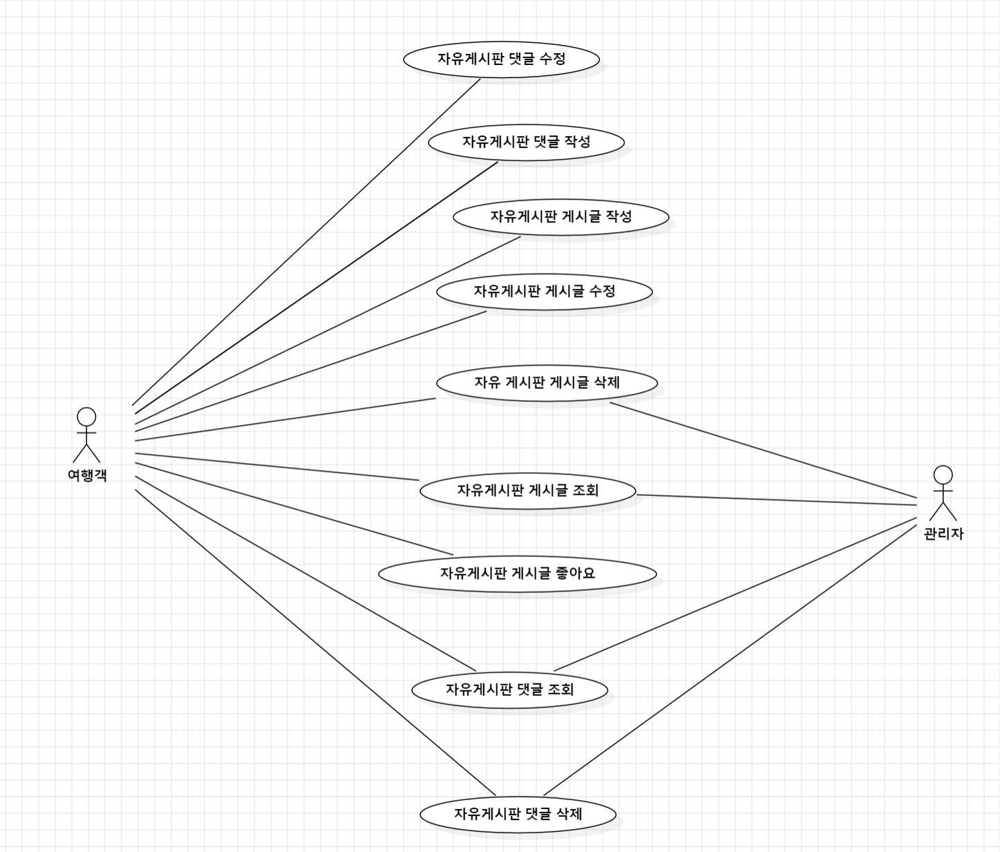
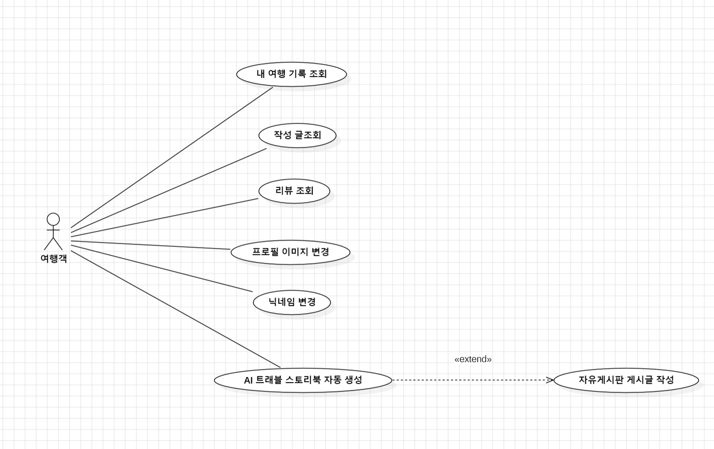
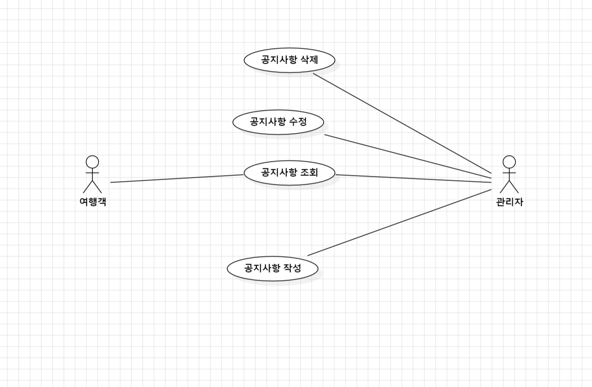
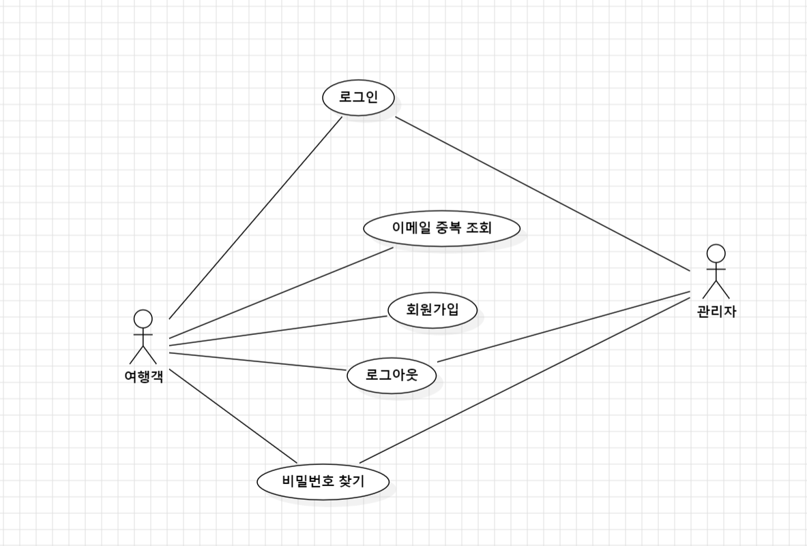
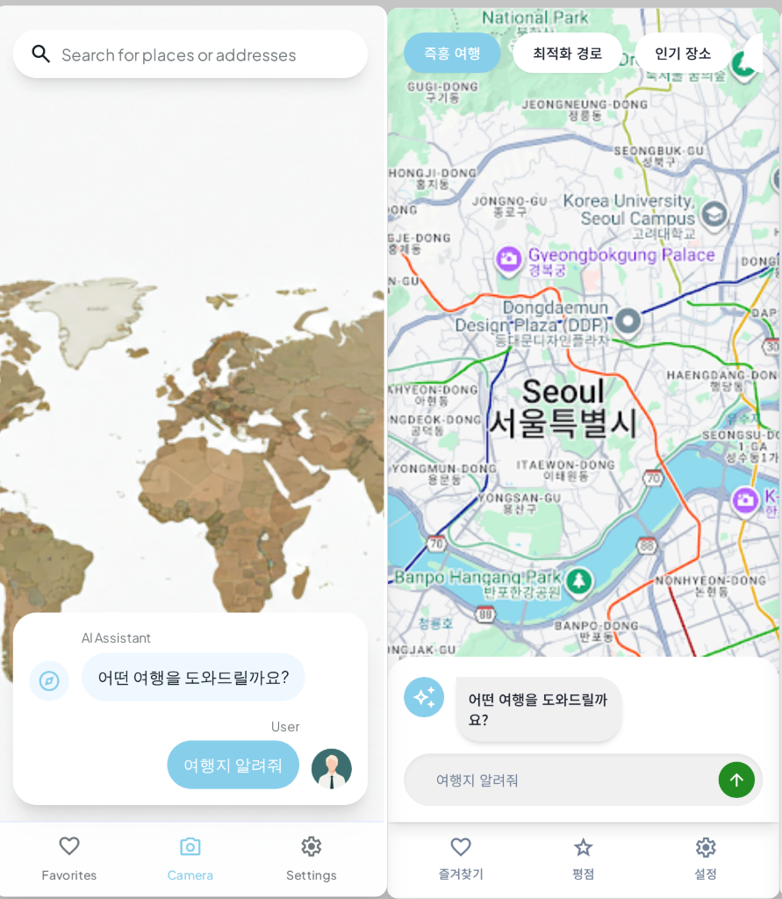
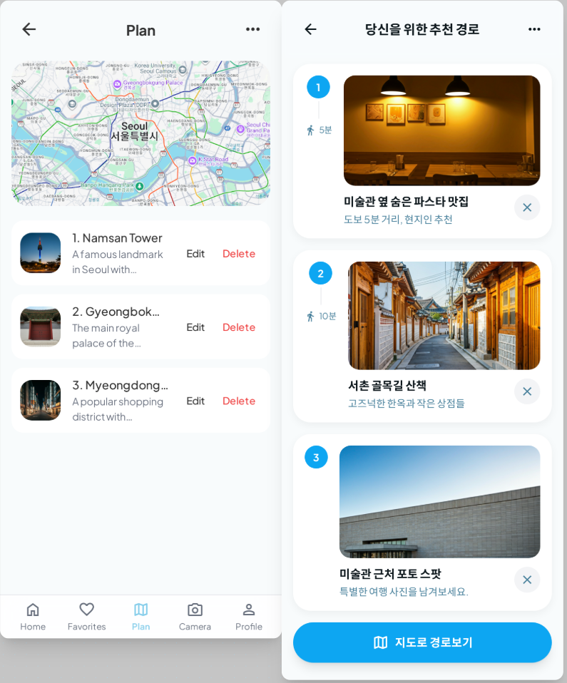
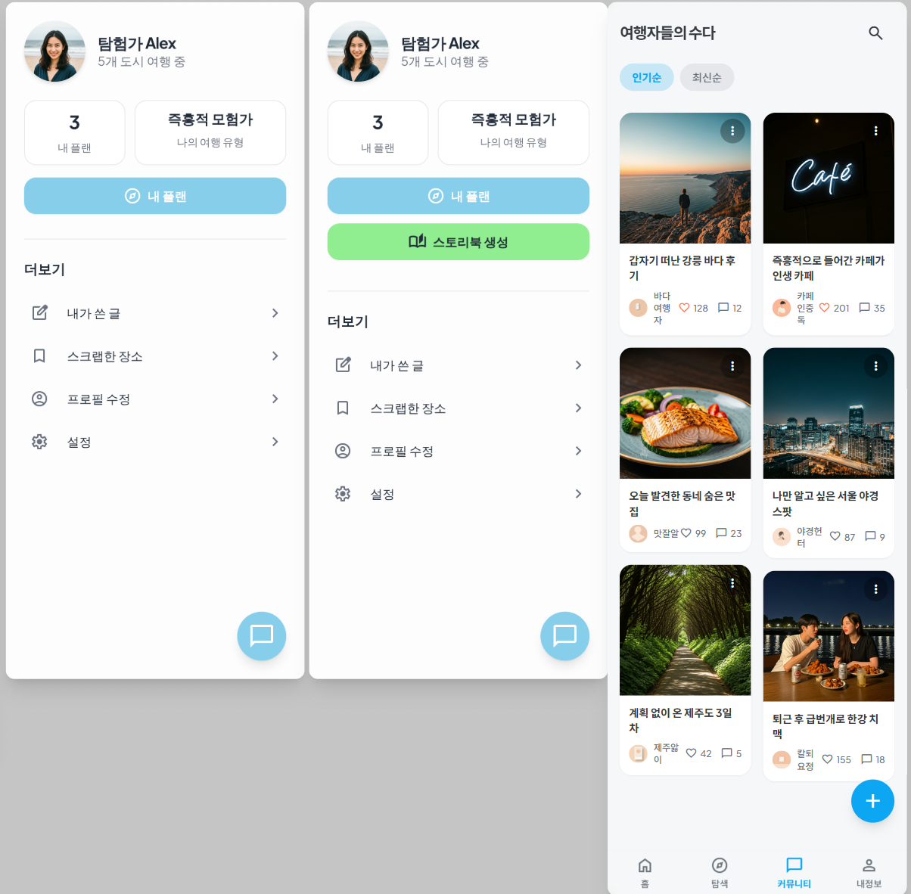

 

# P-PliP ( P 성향 여행자를 위한 즉흥 여행 도우미 )

## 1. 프로젝트 개요

### 1.1. 프로젝트 정의

본 프로젝트는 MBTI 성향 중 **'P'(인식형) 비율이 높은 여행자**들을 위한 즉흥 여행 추천 및 보조 웹 어플리케이션(Web Application)을 기획하고 개발하는 것을 목적으로 합니다.

### 1.2. 문제 제기 (배경)

기존의 대부분 여행 어플리케이션과 플랫폼은 상세한 일정, 최적화된 동선, 사전 예약 등 'J'(판단형) 성향의 사용자에게 최적화된 '계획 수립(Planning)' 기능에 초점을 맞추고 있습니다.

이로 인해 MBTI 성향 중 'P'(인식형) 비율이 높은 사용자들은 다음과 같은 문제(Pain Point)를 겪습니다.

- **계획 수립의 부담:** 맛집, 관광지, 숙소 등 방대한 정보를 탐색하고, 시간대별로 일정을 조율하는 과정 자체를 극도로 귀찮아하거나 심리적 부담을 느낍니다.
- **탐색의 비효율성:** 계획의 필요성은 일부 느끼더라도(중도적 P), 막상 정보 탐색을 시작하는 것을 번거로워하여 결국 비효율적인 여행을 하거나 여행 자체를 포기하기도 합니다.
- **즉흥성 제약:** 경직된 계획은 즉흥적인 여행을 선호하는 이들의 성향과 맞지 않아, 여행의 만족도를 떨어트립니다.

### 1.3. 솔루션 (해결 방안)

본 어플리케이션은 이러한 **'계획 수립의 장벽'을 제거**하고 P 성향 여행자의 즉흥성을 극대화하는 것을 핵심 가치로 삼습니다.

LLM(대규모 언어 모델) 챗봇을 통해 사용자의 모호한 요구(ex. "날씨 좋은데 드라이브 가고 싶다")를 즉각적으로 파악하고, P 성향 스펙트럼에 맞춘 '이중적(Dual) 추천 플로우'를 제공합니다.

1. **극단적 P 성향 (페르소나 1: 김지수) 지원:** 즉각적인 '장소' 자체를 추천하고, 길 찾기 외의 부가적인 계획 제안을 최소화하여 사용자 경험을 높입니다.
2. **중도적 P 성향 (페르소나 2: 이준영) 지원:** 장소 리스트를 우선 제공하되, 사용자가 '선택'할 경우에만 해당 장소와 연계된 부담 없는 '느슨한 세부 계획'을 Just-in-Time (적시)으로 생성하여 제공합니다.

## 2. 프로젝트의 목표

2.1. 목표 사용자

페르소나

<!-- summary 아래 한칸 공백 두어야함 -->
## 페르소나
### 👩‍🎨 페르소나 (Persona)

### 페르소나 1 (극단적 P 성향: 즉흥적 장소 추천형)

- **이름 (가명):** 김지수
- **인구 통계:** 20대 중반 여성 (대학생 또는 사회 초년생)
- **MBTI:** INFP (P 100%에 가까움)
- **여행 스타일:**
    - 완전한 무계획, 즉흥적인 여행을 선호합니다.
    - 계획 수립 과정(정보 탐색, 동선 최적화)을 '일'처럼 느껴 극도로 번거로워합니다.
    - 여행 중에도 기분, 날씨, 컨디션에 따라 다음 목적지를 즉흥적으로 변경할 가능성이 높습니다.
- **주요 시나리오 (User Scenario):**
    - **상황:** 토요일 오후, 4~5시간의 여유 시간이 생겼습니다. 날씨가 좋아 기분 전환 삼아 잠시 드라이브라도 다녀오고 싶지만, 어디로 가야 할지 검색하고 정하는 과정이 귀찮습니다.
    - **행동 (App 사용):**
        1. 앱 실행 후 챗봇에게 "날씨도 좋고 해서 근처로 드라이브 가고 싶다"라고 현재 기분과 상황을 입력합니다.
        2. 사용자의 입력과 관광지의 상세 설명에 대한 유사도를 기반으로 장소 목록을 추천합니다.
        3. 앱이 추천하는 '장소 리스트' 중 가장 마음에 드는 'OO 저수지' 하나만 확인합니다.
    - **결과:** 세부 계획 없이 'OO 저수지'라는 **목적지 자체**만 추천받고 즉시 출발합니다. 앱의 역할은 '갈 곳'을 정해주는 것에서 종료됩니다.

---

### 페르소나 2 (중도적 P 성향: 계획 제공 선호형)

- **이름 (가명):** 이준영
- **인구 통계:** 20대 후반 남성 (직장인)
- **MBTI:** ESTP (P 60~70%)
- **여행 스타일:**
    - 계획을 세우는 과정은 매우 귀찮아하지만, 계획이 없으면 시간을 비효율적으로 보낼까 봐 걱정합니다.
    - 누군가(친구나 앱)가 합리적인 계획이나 코스를 제시해 주면, 큰 불만 없이 즐겁게 따르는 편입니다.
    - 맛집, 숙소 등을 검색하고 비교하는 '탐색 비용'을 최소화하고 싶어 합니다.
- **주요 시나리오 (User Scenario):**
    - **상황:** 다음 주말, 친구와 갑자기 '경주'에 1박 2일로 가기로 했습니다. 큰 지역은 정했지만, 맛집이나 동선 등 세부 계획은 아무도 세우지 않았습니다.
    - **행동 (App 사용):**
        1. 앱을 실행하고 목적지 '경주'를 입력합니다.
        2. 앱이 '황리단길', '유적지 투어', '로컬 맛집' 등 여러 테마의 '추천 장소 리스트'를 보여줍니다.
        3. '황리단길'과 '로컬 맛집' 테마가 마음에 들어 선택합니다.
        4. 장소를 클릭하자, LLM이 **"이 장소들을 중심으로 한 세부 계획을 추천해드릴까요?"**라고 묻습니다.
        5. '예'를 선택합니다.
    - **결과:** 앱이 "A 맛집(점심) → 황리단길 B 카페 → 대릉원 산책"과 같이 **즉석에서 생성된 유연한 세부 계획**을 제공합니다. 이준영은 이 계획을 기반으로 여행을 진행하며, 탐색의 귀찮음 없이 효율적인 여행을 즐깁니다.

두 페르소나(김지수와 이준영)의 요구를 모두 충족시키기 위해, 이 어플리케이션의 핵심 목표는 **"P 성향 여행자의 '계획 수립 부담'을 제로에 가깝게 만들고, '완전한 즉흥성'과 '느슨한 계획' 사이의 스펙트럼을 모두 지원하는 것"**입니다.

이를 달성하기 위한 세부 목표는 다음과 같습니다.

1. **'선택적 계획'을 통한 이중적(Dual) 추천 플로우 제공**
    - **[극단적 P 지원]** 사용자의 현재 기분, 상황, 키워드(ex. 드라이브, 날씨), 남는 시간 등을 기반으로 한 '단일 장소' 또는 **'장소 리스트'**를 최우선으로 제안합니다. (페르소나 1의 니즈 충족)
    - **[중도적 P 지원]** 사용자가 특정 장소나 테마를 선택한 *이후*, LLM이 "관련 세부 계획을 추천해드릴까요?"라고 *선택지*를 제시합니다. (페르소나 2의 니즈 충족)
2. **'Just-in-Time' (적시) 정보 제공을 통한 부담 최소화**
    - 처음부터 사용자에게 완벽한 계획을 요구하거나 제시하지 않습니다.
    - 사용자가 '장소'를 선택하는 바로 그 시점에(Just-in-Time), 다음 행동(세부 계획, 길찾기, 주변 맛집)을 선택적으로 제안하여, 정보 과잉이나 계획의 압박을 느끼지 않게 합니다.
3. **선택의 피로도를 낮추는 직관적인 탐색 지원**
    - **[극단적 P 지원]** '시/군/구 돌림판' 기능을 통해 즉각적 여행지 선택에 니즈를 해소, 탐색 과정을 최소화하는 장치를 제공하여 빠른 결정을 돕습니다.
    - **[중도적 P 지원]** '인기 테마', '추천 코스 리스트' 등을 제공하여, 복잡한 비교/탐색 과정 없이도 검증된 선택을 할 수 있도록 돕습니다.
4. **유연한 여행 보조 기능**
    - 모든 추천 장소나 계획은 '카카오맵 길찾기' 등으로 즉시 연동되어, 탐색과 실행 사이의 간극을 줄입니다.
5. **게시판을 통한 사용자 경험 공유**
    - 게시판에 장소를 태깅하여 해당 장소에 대한 경험을 공유 할 수 있습니다.

## 3. 프로젝트의 타당성

본 프로젝트는 확보된 기술적 실현 가능성, 그리고 강력한 사용자 중심 가치를 바탕으로 높은 타당성을 지니고 있습니다.

### 3.1. 기술적 타당성 (Technical Feasibility)

- **성숙한 LLM 기술:** 자연어(구어체)를 이해하고 키워드를 추출하며, 이를 바탕으로 유연한 계획을 생성하는 핵심 기능은 현재의 LLM API(Gemini, GPT 등)를 통해 충분히 구현 가능합니다.
- **표준화된 API 활용:** 카카오맵 등 외부 지도 API 연동은 기술적으로 표준화되어 있어, '길찾기' 등 핵심 이동 기능을 구현하는 데 장벽이 낮습니다.
- **MVP(최소기능제품)의 용이성:** 복잡한 마이데이터 연동(예산) 대신 Mock Data 기반의 수동 입력 및 사후 리포트 기능을 채택함으로써, 핵심 기능에 집중한 MVP 개발 및 빠른 시장 검증이 가능합니다.

### 3.2. 사용자 가치 및 차별성

- **핵심 문제 해결:** '계획은 귀찮지만, 없으면 불안한' P 성향의 핵심 딜레마를 '선택적 계획'이라는 이중적 플로우로 해결합니다.
- **P 스펙트럼 대응:** '완전 무계획(극단적 P)'부터 '느슨한 계획 선호(중도적 P)'까지, P 성향의 넓은 스펙트럼을 모두 포용할 수 있도록 설계되어 타겟 사용자층의 이탈을 방지합니다.
- **부정적 경험 최소화:** '계획'이라는 단어에서 오는 심리적 압박을 제거하고, '장소 추천', '즉흥 제안' 등의 용어를 사용하여 사용자에게 긍정적인 경험을 제공합니다.

# 4. WBS - 간트차트

# 5. Use Case Diagram
## [ 여행지 관리 ]  

## [ 자유 게시판 관리 ]  

## [ 마이페이지 관리 ]  

## [ 공지사항 관리 ]  

## [ 사용자 관리 ]  

# 6. UI 와이어프레임

### 메인페이지  

### 리스트 + 상세정보  

### 여행 계획  

### 마이페이지 + 게시판  

# Bank

## 📚 커밋 컨벤션 규칙

| Type 키워드 | 사용 시점 |
| --- | --- |
| 첫 커밋 | CREATE: start project |
| Add | 새로운 파일 추가 |
| Delete | 파일 삭제 |
| Feat | 새로운 기능 추가, 기존의 기능을 요구 사항에 맞추어 수정 |
| Fix | 기능에 대한 버그 수정 |
| Build | 빌드 관련 수정 |
| Chore | 패키지 매니저 수정, 그 외 기타 수정 ex) .gitignore |
| Docs | 문서(주석) 수정 |
| Style | 코드 스타일, 포맷팅에 대한 수정 |
| Refactor | 기능의 변화가 아닌 코드 리팩터링 ex) 변수 이름 변경 |
| Test | 테스트 코드 추가/수정 |
| Release | 버전 릴리즈 |
| Rename | 파일 혹은 폴더명을 수정만 한 경우 |
| Readme | README |
| Comment | 주석관련 |

***commit message***
- commit은 최대한 자세히

`키워드(대문자) : 대주제  + (enter) + 설명`

